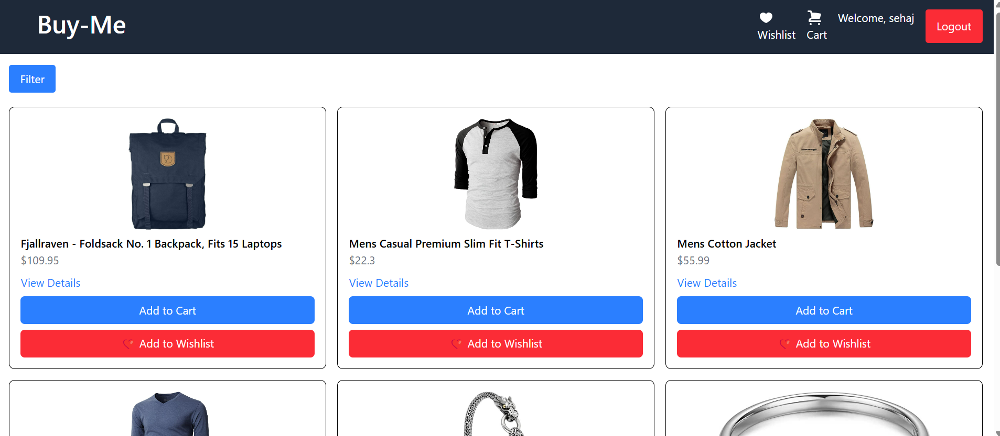
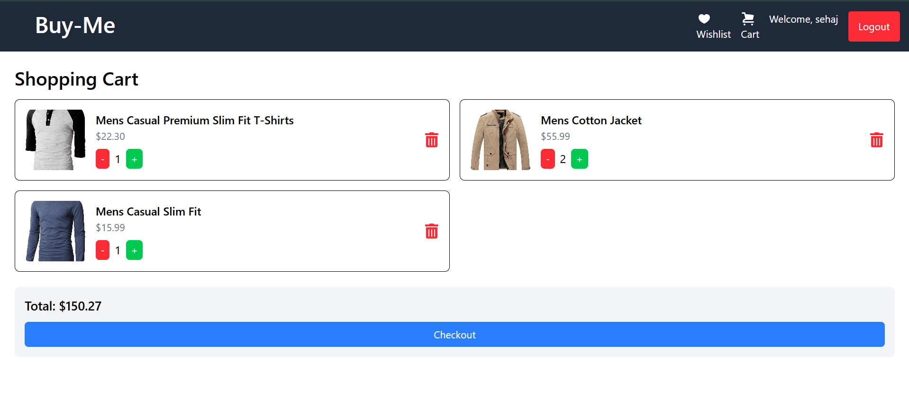
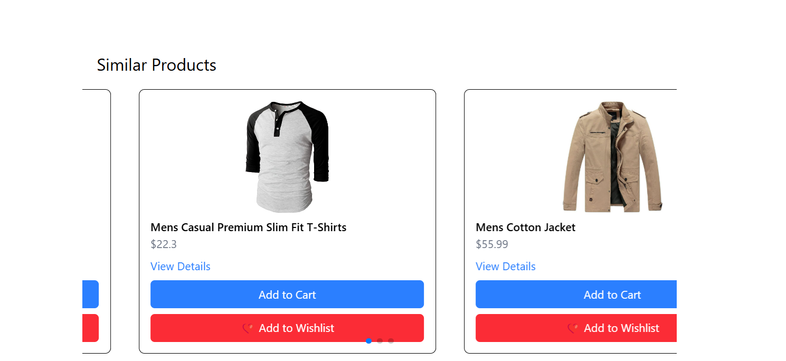
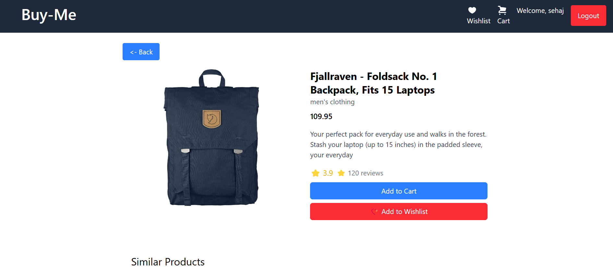

# E-Commerce Store 🛒

A simple e-commerce product catalog built with **ReactJS, Tailwind CSS, and React Context API**.  
It includes features like authentication, product listing, search, filters, shopping cart, wishlist, similar products, and a responsive design.

 Live Link: [https://buy-me-app.netlify.app](https://buy-me-app.netlify.app)

## Features 🚀
- 🔍 **Search & Filter:** Find products by name, category, price range, and rating.
- 🛒 **Shopping Cart:** Add and remove products from the cart.
- ❤️ **Wishlist:** Save favorite products for later.
- 🔑 **Authentication:** Secure signup and login with hashed passwords.
- 📄 **Product Detail Page:** View detailed product descriptions and ratings.
- 🔄 **Similar Products:** Explore related products.

## Screenshots 📸

### 🏠 Home Page  

### 🔑 Signup Page  

### ❤️ Wishlist Page  

### 🛒 Cart Page  

### 🔄 Similar Products Page  

### 📄 Product Detail Page  

